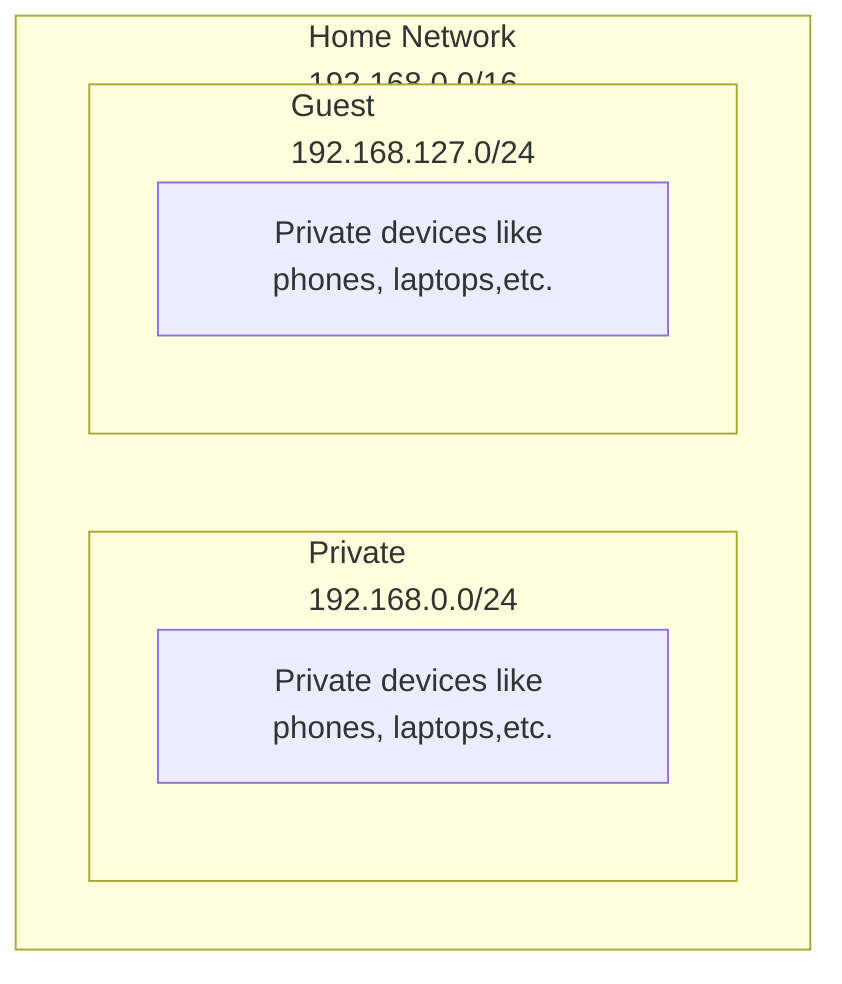
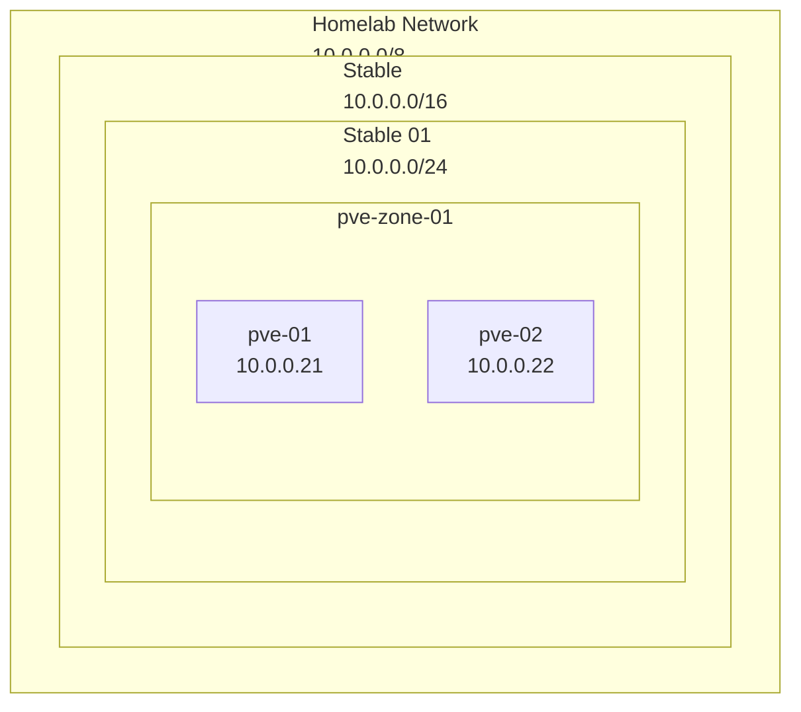

# Network overview

## Wifi/Home networks

The home network is divided into two subnets: a private subnet and a guest
subnet. The private subnet is used for personal devices, while the guest
subnet is used for guests (du-uh). The guest subnet is isolated from the
private subnet as well as the homelab-network, but both subnets can access
the internet.

## Lab network

